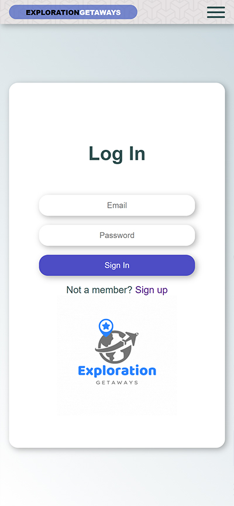
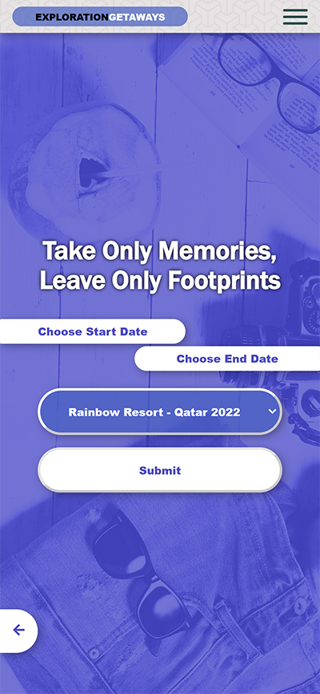
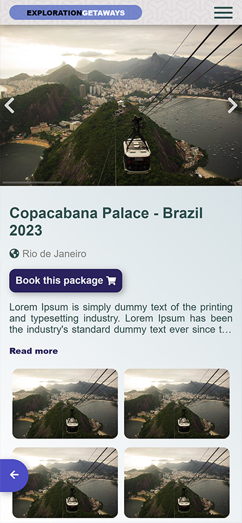
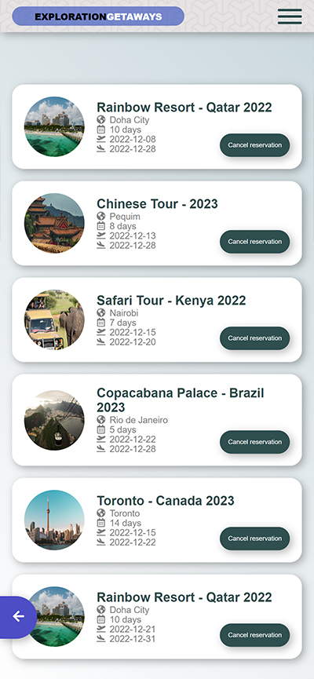

  
# Exploration-Getaways-FRONTEND

Exploration Getaways is a travelling application where the user can register new accounts, login and book a set of different trip packages. It is built and connected by using two different repos, including back-end(Rails) and front-end(React/Redux).

# Backend project

[Repository link](https://github.com/VitorGuedesMadeira/Exploration-Getaways-BACKEND)

# Quick view

# Live Demo Version

Loading

## Getting Started

- Check the node version or if you have one at all by running `node -v ` if you get something like this `v14.17.6` you have Ruby installed.
- Clone the repository by running `git clone git@github.com:Nyame-Wolf/Exploration-Getaways-FRONTEND.git` in your CLI.
- Type `cd Exploration-Getaways-FRONTEND`
- Type `code .`
- Run `npm install`

- Start the backend [Follow instructions in backend Readme](https://github.com/VitorGuedesMadeira/Exploration-Getaways-BACKEND/blob/development/README.md)
- Run `npm start`
- Open Browser `http://localhost:3000/`

# API documentation

[Documentation link](http://localhost:4000/api-docs/)

# Kanban Board

Click here to open the [Kanban Board](https://github.com/Nyame-Wolf/Exploration-Getaways-FRONTEND/projects/1)
[Backend - initial state](https://user-images.githubusercontent.com/103270117/203678348-d2b7954f-e5a9-473d-a33c-22eeee83daf5.png)
[Frontend - initial state](https://user-images.githubusercontent.com/103270117/203832807-99205b68-c036-4bed-8cc3-7482ee46b7db.png)

## Authors (2)

👤 **Vitor Guedes Madeira** 🧑🏻‍💻
- GitHub: [@vitorguedesmadeira](https://github.com/VitorGuedesMadeira)
- Twitter: [@CDahguedes](https://twitter.com/CDahguedes)
- LinkedIn: [Vitor Guedes](https://www.linkedin.com/in/vitor-guedes-madeira/)

👤 **Mumenya Nyamu** 🧑🏻‍💻

- GitHub: [@Nyame-Wolf](https://github.com/Nyame-Wolf)
- Twitter: [@mumenyam](https://twitter.com/Mumenyam)
- LinkedIn: [Mumenya Nyamu](https://www.linkedin.com/in/mumenya-nyamu-software-engineer/)

## 🤝 Contributing

Contributions, issues, and feature requests are welcome!
Feel free to check the [issues page](https://github.com/Nyame-Wolf/Exploration-Getaways-FRONTEND/issues).

## Show your support

Give a ⭐️ if you like this project!

## Design Template

- We give credit to [Murat Korkmaz on Behance](https://www.behance.net/muratk) the author of the [original design](https://www.behance.net/gallery/26425031/Vespa-Responsive-Redesign)

## 📝 License

This project is [MIT](./MIT.md) licensed.
